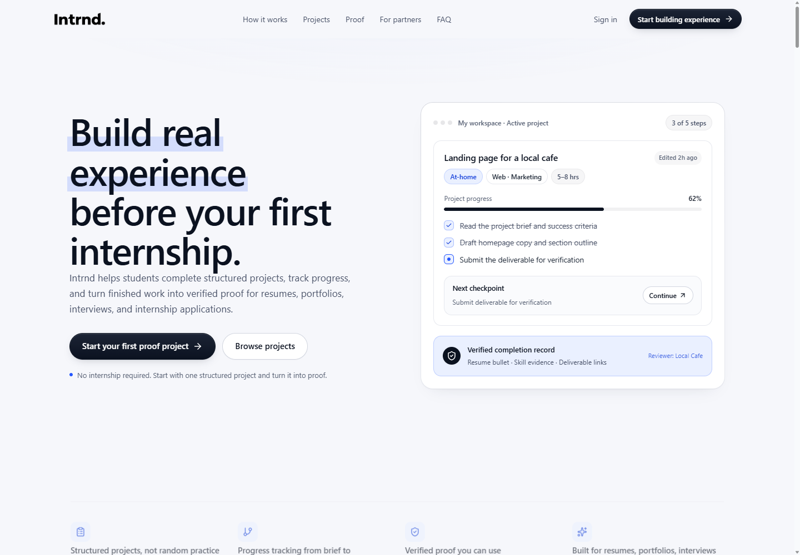
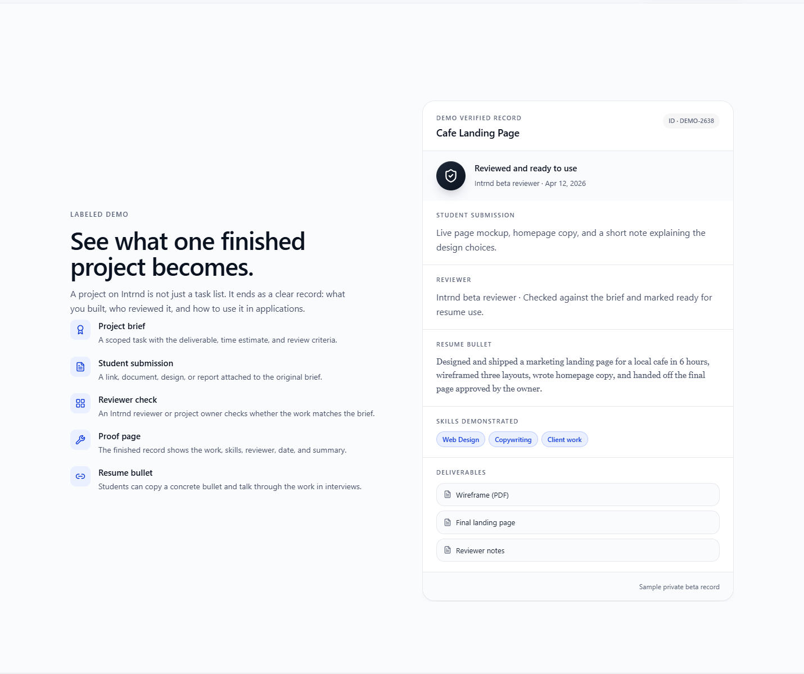
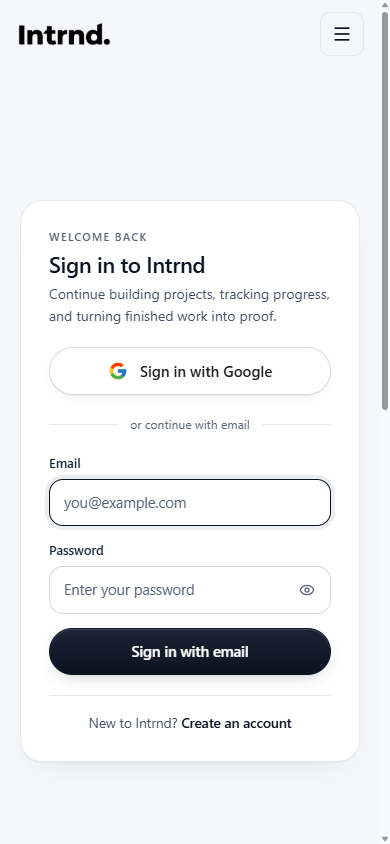

# Intrnd

Build experience before your first internship.

Intrnd is a full-stack platform that helps students turn practice projects into work they can show. Students choose a project, follow a personalized roadmap, and submit evidence for review. The goal is a clear record of what they built, the skills they used, and how the work was checked.

Archived portfolio project. Active development has ended; this repository preserves the implementation for local evaluation and code review.

## Project walkthrough

Screenshots below are from the locally running interface. The homepage workspace and completion record use built-in sample content, not real student submissions.

### From project brief to finished work

The homepage introduces the workflow through a sample workspace: a scoped brief, progress, checkpoints, and a next action. The application includes 130 practice projects, with deterministic recommendations based on the student's saved profile.



### Proof that explains the work

The sample completion record brings together the submission, reviewer, demonstrated skills, and deliverables. In the application, students submit evidence and reviewers can request revisions or verify the work. Completing a checklist alone does not mean a project is verified.



### Mobile account access

The responsive sign-in screen keeps the form usable on a narrow display. Email/password authentication uses server-managed cookie sessions. Google sign-in is also supported when an OAuth client is configured.



## What's included

- React and TypeScript frontend with Vite.
- Express API with cookie-based sessions and role-based permissions.
- PostgreSQL schema and 27 Prisma migrations.
- 130 practice projects, checkpoint plans, ranking rules, and review workflows.
- Tests for ranking, submissions, authorization, privacy, roadmaps, and catalog validation.

Start with [ARCHITECTURE.md](./ARCHITECTURE.md) for the code map. The main implementation is in `src/`, `server/src/`, and `prisma/`.

## Implementation highlights

| Area | What the code demonstrates | Where to look |
|---|---|---|
| Frontend | Route-based pages, shared state, reusable components, and responsive layouts | [App routes](src/App.tsx), [app components](src/components/app/) |
| Recommendations | Profile normalization and repeatable scoring with match explanations | [Ranking service](server/src/ranking/rankingService.ts), [profile features](server/src/personalization/profileFeatureService.ts) |
| Project roadmaps | Checkpoint plans personalized to the student's pace and profile | [Roadmap service](server/src/roadmaps/roadmapService.ts) |
| Evidence and review | Submission requirements, file validation, and controlled status transitions | [Submissions](server/src/submissions/), [application lifecycle](server/src/projects/applicationLifecycle.ts) |
| Authentication | Cookie sessions, role checks, and server-side access control | [Authentication](server/src/auth/), [middleware](server/src/middleware/) |
| Data and testing | Relational modeling, versioned migrations, and tests for core rules | [Prisma schema](prisma/schema.prisma), [test commands](package.json) |

## Project status

Payments, subscriptions, organization publishing, password recovery, and public legal-policy pages are not implemented. This is an archived prototype for local evaluation, not an operating service. Optional model-backed features and scraping are disabled by default; neither is needed for the main workflow.

## Local setup

Requirements: Node.js 22.12 or newer, npm, and PostgreSQL 16 or newer. Docker Desktop is one way to run PostgreSQL.

Install the locked dependencies:

```bash
npm ci
```

Copy `.env.example` to `.env`. Keep it local. Generate a session secret with the following command and use its output for `JWT_SECRET`:

```bash
node -e "console.log(require('node:crypto').randomBytes(32).toString('hex'))"
```

On Windows with Docker Desktop, run:

```bat
run-intrnd.bat
```

The launcher starts the local database, generates Prisma's client, applies migrations, and starts the frontend and API. Its fixed database and session credentials are for local development only. It does not stop unrelated programs; close any existing Intrnd servers using ports 4000 and 5173 before starting it.

For manual setup, start a local database matching the example connection string:

```bash
docker run --name intrnd-postgres -e POSTGRES_USER=intrnd -e POSTGRES_PASSWORD=intrnd_local_password -e POSTGRES_DB=intrnd -p 127.0.0.1:54329:5432 -d postgres:16-alpine
docker exec intrnd-postgres pg_isready -U intrnd -d intrnd
```

Wait until PostgreSQL reports that it is accepting connections. On later runs, use `docker start intrnd-postgres`. If you already have PostgreSQL, create a separate development database and set `DATABASE_URL` in `.env` instead.

```bash
npm run prisma:generate
npm run db:deploy
npm run dev:full
```

Open `http://127.0.0.1:5173`. The API runs at `http://127.0.0.1:4000`. Startup imports the included catalog and synchronizes its roadmaps and candidate mappings.

For resettable local accounts:

```bash
npm run qa:reset
```

The command prints local student and admin logins. It replaces only its named QA accounts and refuses production or non-local database targets. Admins sign in normally and open `/admin`; there is no shared production admin login.

Google sign-in needs your own OAuth client configuration. Leave its environment variables blank to use email/password sign-in only.

## Checks

Use a separate local development database. The roadmap test reads the 130 included catalog projects; it does not need historical user data.

```bash
npm run prisma:generate
npm run db:deploy
npm run seed:projects:v3
npm run roadmaps:sync
npm test
npm run build:full
npm audit
```

`build:full` runs frontend and backend type checks before producing `dist/` and `dist-server/`. The dependency overrides pin patched build/configuration helpers; recheck them when upgrading Prisma, Vite, or tsx.

## Sharing and deployment

Upload this source folder, not your working environment. Keep `.env`, `node_modules/`, build output, local uploads, database files, logs, and test artifacts out of Git. The included `.gitignore` covers those files.

GitHub source hosting does not run the Express API or PostgreSQL database. [DEPLOYMENT.md](./DEPLOYMENT.md) describes the extra services and configuration a live deployment would require. Do not enable public registration on an archived prototype without completing the unfinished workflows and policies.
